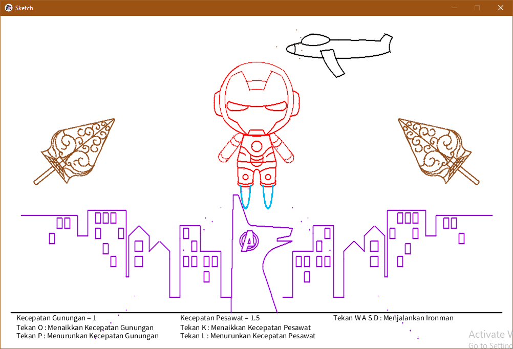

Nama Program	: Wayang x Ironman
Penulis Program	: Rifqi Irfansyah

Deskripsi	: 
Program ini mengimplementasikan penggunaan dasar bangun datar 2D yang diciptakan dari garis bresenham. Program ini menampilkan tokoh wayang Ironman sebagai karakter utama, diiringi oleh elemen-elemen tradisional seperti gunungan, serta elemen pesawat dan latar belakang perkotaan. 
Semua objek digambar menggunakan algoritma Bresenham tanpa memanfaatkan fungsi bawaan py5 termasuk bezier. Program ini juga dilengkapi dengan animasi dan interaksi yang dapat membuat objek terlihat hidup, pengguna dapat berinteraksi secara langsung dengan animasi yang dihasilkan.

